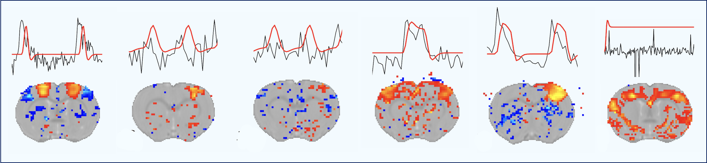

# Multicenter comparison of sensory evoked fMRI in the rat.

*How Variable Are Our Rat Sensory-Evoked Functional MRI Datasets?*

## Description
Extending the international collaborative project of Grandjean et al., 
we aim to perform a fMRI multi-center comparison of stimulus-  evoked
response in rats. The main goal is to optimize fMRI pre-processing to 
enhance the detectability of activation patterns  and to identify best
practices. To do so, fMRI datasets from international laboratories will 
be gathered. We will assess whether the Noise Reduction with Distribution 
Corrected (NORDIC) principal component analysis can increase the statistical 
detection of evoked response. Second we will examine the impact of different
hemodynamic   response   functions   on   signal   detection   and   residual
analysis. We are determined to make the results accessible to researchers and 
eventually be published in a peer-reviewed journal.

## Goals
- To provide a large rat fMRI collective dataset
- To provide evidence-based recommendations for rat fMRI acquisition
- To test  the effectiveness of denoising fMRI data using NORDIC
- The generalization of hemodynamic response function (HRF) across fMRI datasets
- To  test the anatommical specificity of the sensory evoked response in rats 
- To foster collaborations and discussion within the community

## Links   
[Preregistration DOI: https://doi.org/10.17605/OSF.IO/8VY9R](https://doi.org/10.17605/OSF.IO/8VY9R)